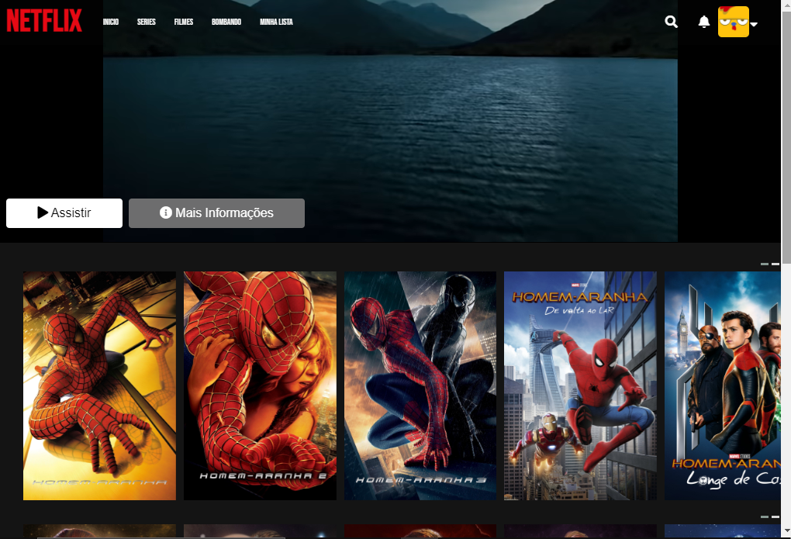
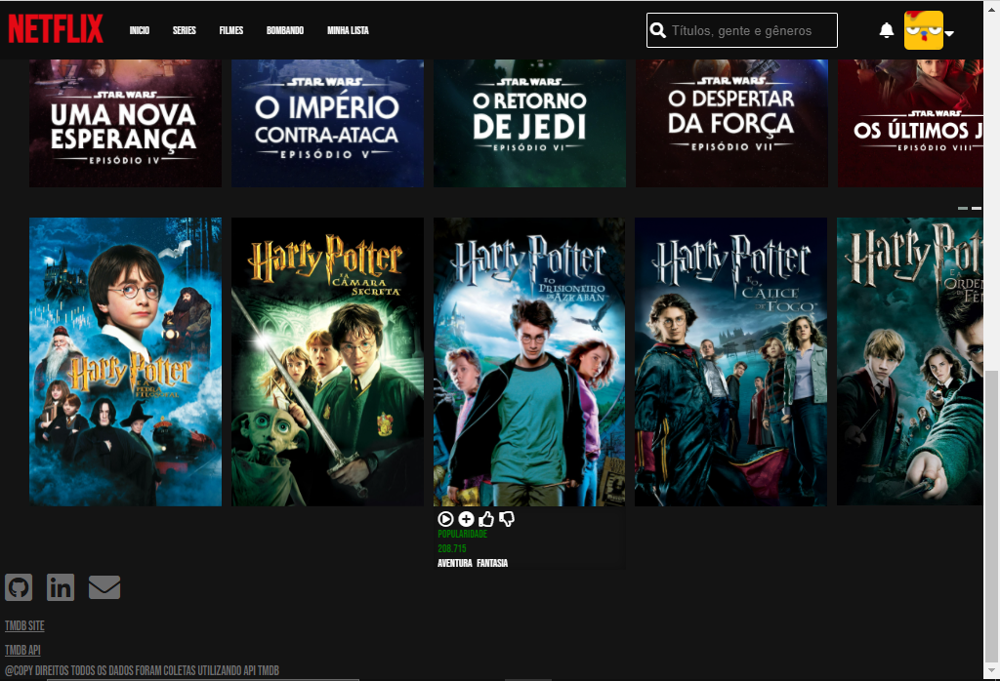

# Clone-Netflix
🎬 Recriando catálogo de filmes da Netflix

 

- Praticando JavaScript com imports e exports

- Api TMDB: Banco de dados

- FeatchApi: Consumo da api

- owl carousel: carrossel de imagens

   

- Busca filmes por ID

- Botões de Like e Dislike 

- Exibir trailer do filme ao clicar no botão play do carrossel

- Exibir descrição do filme ao clicar em mais informações

   

  Trailer Padrão Harry Potter

  remover ou adicionar filmes: array bloco no componente id/Id.js

  cada array corresponde a um carrossel de imagens que será criado. 

  Ajustes

  - [ ] Responsivo

